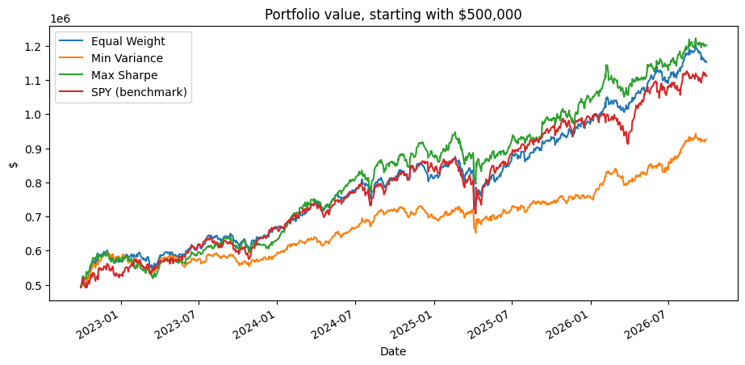
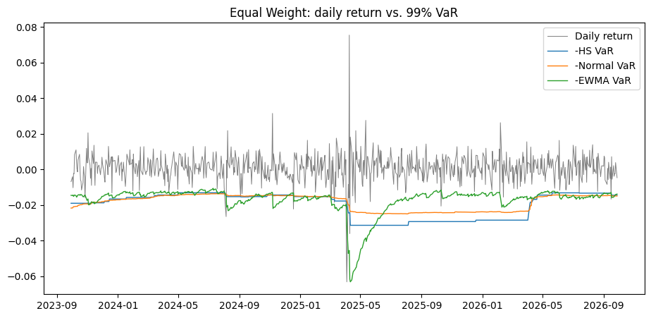
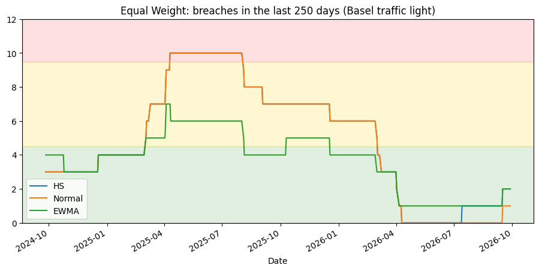

# Market Risk Modeling: VaR/ES Forecasting and Backtesting of a 30-Stock Portfolio

This project builds three \$500,000 equity portfolios from 30 U.S. stocks across 5 sectors, forecasts their daily market risk with three Value-at-Risk (VaR) and Expected Shortfall (ES) models, and backtests whether the VaR forecasts were accurate.

The full analysis, code and results are in [`market_risk_project.ipynb`](market_risk_project.ipynb).

## Key findings

- **Optimization did not beat simple diversification.** The Max Sharpe portfolio had the same Sharpe ratio as the Equal Weight portfolio (1.39). Expected returns estimated from historical data were too noisy to add value out-of-sample.
- **EWMA was the best-calibrated VaR model.** Its breach count was the closest to the expected number in all three portfolios.
- **Historical simulation reacts slowly (the "ghost effect").** After the April 2025 tariff shock, historical-simulation VaR stayed elevated for a full year and dropped only when the shock days left the 250-day window. EWMA VaR spiked immediately and normalized within about three months.
- **Beta is not stable.** Energy stocks had negative betas (−0.50 to −0.63) over the last year because the 2026 oil supply shock pushed oil prices up while the market fell. This lowered the Equal Weight portfolio's beta to 0.43.

## Results

**Performance (Sep 2022 – Sep 2026, initial capital \$500,000)**

| Portfolio | Final Value | Ann. Return | Ann. Volatility | Sharpe Ratio | Max Drawdown |
|---|---|---|---|---|---|
| Equal Weight | \$1,152,362 | 23.4% | 13.2% | 1.39 | −16.6% |
| Minimum Variance | \$925,764 | 16.8% | 11.1% | 1.14 | −10.7% |
| Max Sharpe | \$1,201,883 | 24.7% | 14.1% | 1.39 | −16.0% |
| SPY (benchmark) | \$1,111,342 | 22.3% | 15.8% | 1.13 | −18.8% |

**VaR backtest (99% 1-day VaR, 751 days, 7.5 breaches expected)**

| Portfolio | Historical Simulation | Parametric Normal | EWMA |
|---|---|---|---|
| Equal Weight | 12 | 11 | 10 |
| Minimum Variance | 11 | 10 | 9 |
| Max Sharpe | 9 | 5 | 8 |

None of the nine models was rejected by the Kupiec test at the 5% level.







## Data and setup

- **Stocks:** 6 large-cap stocks in each of Technology, Financials, Healthcare, Energy and Consumer Staples; SPY as the market benchmark
- **Data:** Daily adjusted prices from Yahoo Finance (`yfinance`), Oct 2021 – Sep 2026
- **Timeline:** Year 1 estimates the first portfolio weights, year 2 fills the first 250-day VaR window, and years 3–5 are used for backtesting (Sep 2023 – Sep 2026)
- **Constraints:** Long-only, fully invested, maximum 10% per stock, quarterly rebalancing using only past data

## Methods

| Step | Methods |
|---|---|
| Portfolio construction | Equal Weight, Minimum Variance, Max Sharpe (mean-variance) |
| Market exposure | CAPM beta by stock and portfolio, sector weights |
| Risk measurement | 1-day 99% VaR and 97.5% ES: Historical Simulation, Parametric Normal, EWMA (RiskMetrics, λ = 0.94) |
| Backtesting | Breach counts, Kupiec proportion-of-failures test, Basel traffic light |

## How to run

```bash
pip install -r requirements.txt
jupyter notebook market_risk_project.ipynb
```

The notebook can also be run in Google Colab. Built with Python (pandas, NumPy, SciPy, matplotlib, yfinance).
